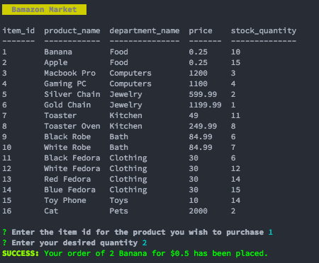
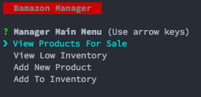
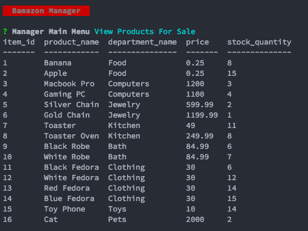
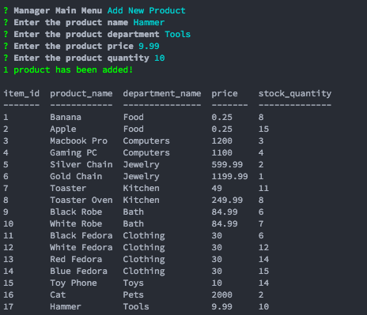
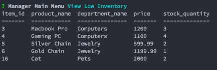
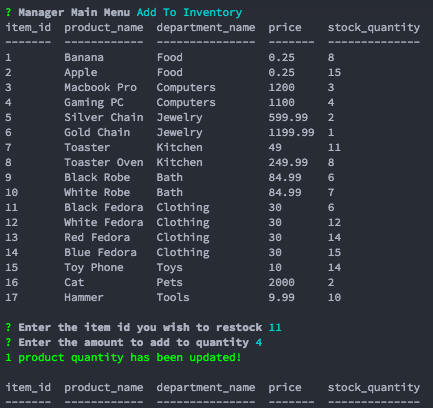

# bamazon
_UCSD Coding Bootcamp. Week 7 - Homework 1_
Bamazon is a simple node.js command line interface that connects to a MySQL database to demonstrate queries between the two.

## Customer View
1. The customer is able to only purchase products which are pulled from the database.
As you can see below the user is shown a table of products, and is prompted to select an item and quantity. On selection, the user gets the total price.

## Manager View
1. Unlike the Customer view, the Manager view is capable of performing multiple actions.

2. Like the aforementioned view however, the Manager can of course view the products in the database.

3. If desired, the Manager can add a new product into the database.

4. The manager can also view only products that are low on inventory (less than 5.)

5. Of course, the manager can restock any of the products regardless of the inventory amount.

## Video Demonstration
https://youtu.be/Td9urDJJau0